# 迭代开发七阶段概览图

> Generated by excalidraw-diagram-gen skill
> Date: 2026-07-03
> Type: flowchart

## Purpose

可视化迭代开发工作流的七个标准阶段，展示每个阶段的产出物和关键动作，以及阶段之间的顺序依赖关系。

## Mermaid Source

```mermaid
flowchart LR
    subgraph S1["01-需求分析"]
        A1[产出: 01-需求记录.md]
        A2[读Spec活文档]
        A3[与用户确认需求]
    end

    subgraph S2["02-需求评审"]
        B1[产出: 02-需求评审.md]
        B2[reviewer视角审阅]
        B3[提问 → 用户决议]
    end

    subgraph S3["03-技术方案"]
        C1[产出: 03-技术方案.md]
        C2[代码探索]
        C3[方案设计]
        C4[Delta标记]
        C5[命名冲突预检]
    end

    subgraph S4["04-开发实现"]
        D1[产出: 任务清单.md + 代码]
        D2[清单生成]
        D3[自动审查]
        D4["★ 用户确认清单"]
        D5[Team Agent并行开发]
        D6[编译单元注册]
        D7[构建验证]
        D8[代码审查]
    end

    subgraph S5["05-测试验证"]
        E1[产出: 05-测试验证报告.md]
        E2[构建验证]
        E3[用例自动生成]
        E4[自动执行 → 降级手动]
    end

    subgraph S6["06-发布上线"]
        F1[产出: 06-发布上线记录.md]
        F2[编译]
        F3[部署]
        F4[Spec活文档更新]
        F5[状态归档]
    end

    subgraph S7["07-迭代回顾"]
        G1[产出: 07-迭代回顾报告.md]
        G2[迭代总结]
        G3[问题清单]
        G4[模式沉淀]
        G5[正向模式提炼]
        G6[回顾归档释放ACTIVE]
    end

    S1 --> S2 --> S3 --> S4 --> S5 --> S6 --> S7

    classDef phase1 fill:#e3f2fd,stroke:#1976d2,stroke-width:2px
    classDef phase2 fill:#e8f5e9,stroke:#388e3c,stroke-width:2px
    classDef phase3 fill:#fff3e0,stroke:#f57c00,stroke-width:2px
    classDef phase4 fill:#fce4ec,stroke:#c62828,stroke-width:2px
    classDef phase5 fill:#f3e5f5,stroke:#7b1fa2,stroke-width:2px
    classDef phase6 fill:#e0f7fa,stroke:#00838f,stroke-width:2px
    classDef phase7 fill:#fff9c4,stroke:#fbc02d,stroke-width:2px

    class S1 phase1
    class S2 phase2
    class S3 phase3
    class S4 phase4
    class S5 phase5
    class S6 phase6
    class S7 phase7
```

## Key Principles Reflected

- **阶段不可跳过**：S1→S7 严格顺序
- **文档驱动**：每个阶段有明确产出文档
- **04阶段强制Team Agent**：S4 包含 Team Agent 并行开发
- **用户确认节点**：S4 中标注 ★ 用户确认清单
- **构建验证强制**：S4/S5 均包含构建验证步骤

## How to Edit in Excalidraw

1. Open https://excalidraw.com
2. Paste Mermaid code into a Mermaid-supported editor (like https://mermaid.live/)
3. Export as SVG and import into Excalidraw for manual layout adjustments
4. For best results, recreate in Excalidraw using the diagram as reference

## Notes

- 对应 SKILL.md 第 36-45 行「七阶段概览」表格
- 每个阶段用不同颜色区分，便于识别
- 可在 SKILL.md 中通过 `@design/diagrams/flow-seven-phases.md` 引用
