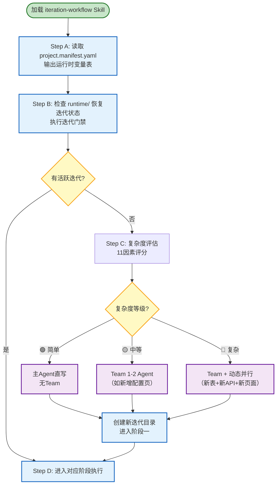

# 启动协议流程图

> Generated by excalidraw-diagram-gen skill
> Date: 2026-07-03
> Type: flowchart

## Purpose

可视化 Agent 加载 iteration-workflow Skill 后的启动协议，展示从加载到进入阶段执行的完整决策路径。

## Mermaid Source

## Decision Points

| 决策点 | 条件 | 分支 |
|--------|------|------|
| 有活跃迭代? | runtime/ 中存在 ACTIVE 标记 | 是 → 直接进入对应阶段 |
| 复杂度等级? | 11因素评分结果 | 🟢简单 / 🟡中等 / 🔴复杂 |

## How to Edit in Excalidraw

1. Open https://excalidraw.com
2. Paste Mermaid code into https://mermaid.live/ to render
3. Export as SVG and import into Excalidraw for manual layout adjustments
4. For best results, recreate in Excalidraw using the diagram as reference

## Notes

- 对应 SKILL.md 第 19-30 行「启动协议」
- 完整流程定义见 `engine/startup-protocol.md`
- 复杂度评估算法见 `engine/complexity-scoring.md`
