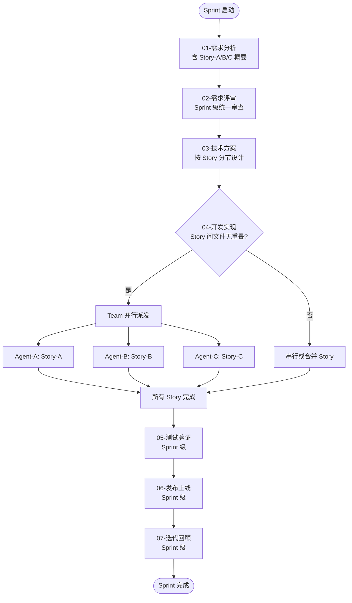

# 多 Story 并行模式 · 详细图示与并行决策

> 本文件为 SKILL.md「★ 多 Story 并行模式」章节的图示与并行决策细节补充。SKILL.md 常驻入口仅保留组织层约定（文档结构、阶段拆分、目录约定、任务清单格式），纯图示与四维决策细节下沉至此，以降低每次触发 Skill 的常驻上下文体积。

## Sprint 级工作流图



## 并行条件（★ 四维决策）

"文件变更无重叠"只是快速初筛条件。最终并行决策的四维算法与 `engine/team-agent-strategy.md` 一致，此处给出多 Story 场景下的应用映射：

| 维度 | 多 Story 并行中的应用 |
|------|------|
| 依赖类型 | Story 间存在接口依赖（A 调用 B 的 API，方案已定义签名）→ 仍可并行 |
| 操作类型 | 两 Story 都"新建文件" → 大胆并行；一个"新建"一个"替换已有代码" → 审慎 |
| 方案完整度 | 方案中有完整代码 → 近乎全并行；只有描述 → 先探索再串行 |
| 冲突依赖 | 两 Story 修改同一文件 → 必须串行或合并为一个 Story |

```
并行度决策流程：
文件无重叠？（初筛）
  ├─ 否 → 串行或合并 Story
  └─ 是 → 四维分析
         ├─ 有接口依赖？→ 可以并行（方案已约定签名）
         ├─ 有冲突依赖？→ 串行化共享文件任务
         └─ 无依赖？→ ✅ 完全并行

Team "sprint-xxx" →
  Agent-A: 开发 Story-A（T1-T4）  ─┐
  Agent-B: 开发 Story-B（T5-T8）  ─┼─ 并行执行，互不冲突
  Agent-C: 开发 Story-C（T9-...） ─┘
```
