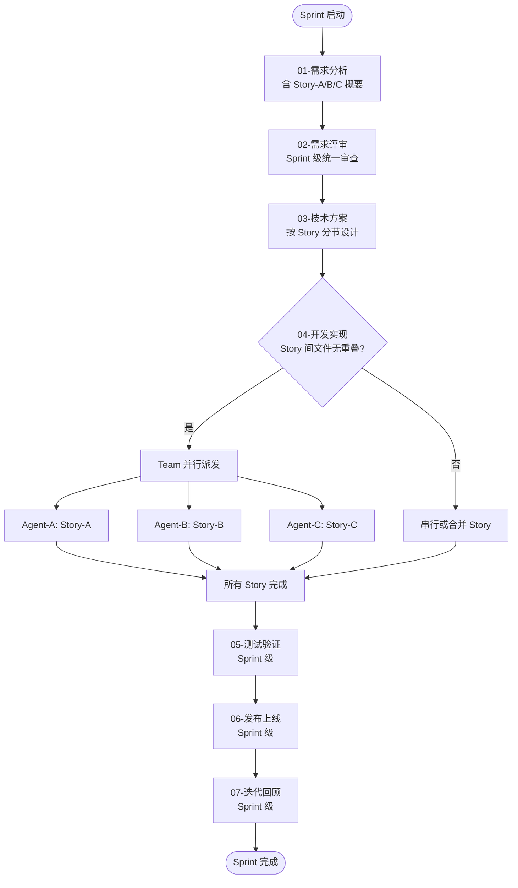

# 多 Story 并行模式 · 详细图示与并行决策

> 本文件为 SKILL.md「★ 多 Story 并行模式」章节的图示与并行决策细节补充。SKILL.md 常驻入口仅保留组织层约定（文档结构、阶段拆分、目录约定、任务清单格式），纯图示与四维决策细节下沉至此，以降低每次触发 Skill 的常驻上下文体积。

## Sprint 级工作流图


```mermaid
flowchart TD
    START([Sprint 启动]) --> P01[01-需求分析<br/>含 Story-A/B/C 概要]
    P01 --> P02[02-需求评审<br/>Sprint 级统一审查]
    P02 --> P03[03-技术方案<br/>按 Story 分节设计]
    P03 --> P04_SPLIT{04-开发实现<br/>Story 间文件无重叠?}

    P04_SPLIT -->|是| P04_PARALLEL[Team 并行派发]
    P04_PARALLEL --> AGENT_A[Agent-A: Story-A]
    P04_PARALLEL --> AGENT_B[Agent-B: Story-B]
    P04_PARALLEL --> AGENT_C[Agent-C: Story-C]

    P04_SPLIT -->|否| P04_SERIAL[串行或合并 Story]

    AGENT_A --> P04_DONE[所有 Story 完成]
    AGENT_B --> P04_DONE
    AGENT_C --> P04_DONE
    P04_SERIAL --> P04_DONE

    P04_DONE --> P05[05-测试验证<br/>Sprint 级]
    P05 --> P06[06-发布上线<br/>Sprint 级]
    P06 --> P07[07-迭代回顾<br/>Sprint 级]
    P07 --> END([Sprint 完成])
```

## 并行条件（★ 四维决策）

"文件变更无重叠"只是快速初筛条件。最终并行决策的四维算法与 `engine/team-agent-strategy.md` 一致，此处给出多 Story 场景下的应用映射：

| 维度 | 多 Story 并行中的应用 |
|------|------|
| 依赖类型 | Story 间存在接口依赖（A 调用 B 的 API，方案已定义签名）→ 仍可并行 |
| 操作类型 | 两 Story 都"新建文件" → 大胆并行；一个"新建"一个"替换已有代码" → 审慎 |
| 方案完整度 | 方案中有完整代码 → 近乎全并行；只有描述 → 先探索再串行 |
| 冲突依赖 | 两 Story 修改同一文件 → 必须串行或合并为一个 Story |

```
并行度决策流程：
文件无重叠？（初筛）
  ├─ 否 → 串行或合并 Story
  └─ 是 → 四维分析
         ├─ 有接口依赖？→ 可以并行（方案已约定签名）
         ├─ 有冲突依赖？→ 串行化共享文件任务
         └─ 无依赖？→ ✅ 完全并行

Team "sprint-xxx" →
  Agent-A: 开发 Story-A（T1-T4）  ─┐
  Agent-B: 开发 Story-B（T5-T8）  ─┼─ 并行执行，互不冲突
  Agent-C: 开发 Story-C（T9-...） ─┘

---

## Schema 映射（概念 → 可执行）⭐ 2026-07-23 落地

> 本文件原仅为概念/图示设计。F06 将其与 `state-protocol.md` 的 `stories[]` schema 对接，使多 Story 并行成为可落地的状态管理能力。

### 1. stories[] 与多 Story 的对应

- Sprint 级阶段（01/02/03/05/06/07）沿用 top-level `phase_steps`，不拆分
- 仅 04 阶段将开发执行拆为 `stories[]`：每个 Story 一个对象，含 `dev_steps`（代码新建/替换类步骤）+ `tasks_*`
- 04 完成判定（见 state-protocol.md §二）：Sprint 级步骤结清 AND 所有 `stories[].status ∈ {completed, abandoned}`

### 2. 任务清单文档章节约定

`docs/iterations/{ID}/开发任务清单.md` 按 `## STORY-A / ## STORY-B / ...` 分节，与 `stories[]` 一一对应（原则 #4 任务清单唯一真相源的分 Story 落地）。

### 3. SQL 步骤归属（默认 Sprint 级 + 可选下放）

- **默认**：走 Sprint 级 `step-0-sql-gen` / `step-0-sql-review` / `step-0-sql-exec`（99% 场景为单库统一变更，统筹更安全）
- **可选下放**：若各 Story 独立涉及不同表/不同 DB 变更，可将 `step-0-sql-*` 下放到各 Story 的 `dev_steps`，同时 Sprint 级 `phase_steps` 中对应步骤标记为 `not_applicable`

### 4. 子 Agent 写入模式（父 Agent 串行化合并写）

- **本次实现**：父 Agent（主 Agent）独占 `state.yaml` 写入权。子 Agent（Agent-A/B/C）只执行代码并回报进度，由父 Agent 合并写入对应 `stories[]`
- 复用 F03 并发协议（per-iteration `mkdir` 锁 + 乐观锁 version），无跨文件一致性问题
- **不采用** per-Story 独立 state 文件方案（会引入「XX 阶段完成但 YY 文件缺失」的跨文件一致性校验，工程量远大于收益）

### 5. 恢复输出（压缩格式）

见 `state-protocol.md` §四.3：Sprint 概要 + 逐 Story 摘要行（如 `✅ STORY-A 3/4 任务完成`），追问某 Story 时再展开 `dev_steps` 明细。
```
