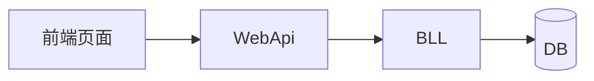

# 03-技术方案 · {迭代名称}

<!-- 填写纪律（SSOT：engine/doc-style-guide.md）
     ① 代码骨架、完整 SQL、审查处置记录一律进附录；正文只留签名与结论
     ② 表格 ≤6 列、单元格 ≤60 字；超长改"小标题 + 缩进列表"；编号统一 1./1.1
     ③ 结构增强：>200 行加 `## 目录`；引用写相对链接；图示用 Mermaid（SSOT §7）
     ④ 生成后自检：python scripts/doc_lint.py <本文件> -->

| 项 | 值 |
|:--|:--|
| 迭代 ID | `YYYY-MM-DD-NNN-{名称}` |
| 阶段 | 03-技术方案 |
| 状态 | ⏳ 进行中 |
| 影响等级 | 🟢 Standard / 🟡 Normal / 🔴 Emergency（见 gate-protocol.md） |
| 上游文档 | [01-需求记录](../01-需求分析与设计/01-需求记录.md) · [02-需求评审](../02-需求评审/02-需求评审.md) |
| 更新时间 | YYYY-MM-DD |

---

## 结论摘要

- **方案要点**：2~3 条
- **决策点**：N 项（✅ 已拍板 / ⏳ 待定，见 §7）
- **回滚要点**：一句话（详见 §8）
- **下一步**：04-开发实现

---

## 1. 现状与痛点

## 2. 改造方案

### 2.1 数据库变更（DDL）

> 幂等脚本要点写在此处（≤10 行）；完整脚本放附录 B。无则写"无"。

### 2.2 数据流设计 *必填

> 改造后的数据流用 Mermaid（SSOT §7.4）；跨系统调用建议另加 `sequenceDiagram` 画时序。

### 2.3 页面设计（如有）

## 3. 代码改动范围 *必填

> Delta 标记：ADDED / MODIFIED-🔵追加 / MODIFIED-🟡修改 / MODIFIED-🔴替换 / REMOVED（见 engine/delta-marking.md）
> 表列固定 4 列。

### 3.1 后端

| # | 文件 | Delta | 说明 |
|:--:|:--|:--:|:--|

### 3.2 前端

| # | 文件 | Delta | 说明 |
|:--:|:--|:--:|:--|

### 3.3 SQL

| # | 文件 | Delta | 说明 |
|:--:|:--|:--:|:--|

### 3.4 明确不动

> 列出明确不动的关键文件，避免误改。

## 4. 接口设计

### 4.1 接口总览

| 端点 | 入参 | 用途 |
|:--|:--|:--|

### 4.2 接口明细

<!-- 每个端点一个小节：入参 / 出参 / 值域 / 错误码 / 边界。代码骨架放附录 A。 -->

## 5. 命名冲突预检 *必填

| 目标文件 | 搜索方法名 | 结果 | 处理 |
|:--|:--|:--:|:--|

> 对所有 MODIFIED 类型的目标文件，验证新方法名不冲突（见 engine/naming-conflict-check.md）。

## 6. 开发阶段拆解

> 粗粒度拆解，详细任务清单在 04 阶段生成。

## 7. 决策点

| # | 决策 | 结论 |
|:--:|:--|:--|

## 8. 回滚方案（🟡🔴 强制）

| 维度 | 内容 |
|:--|:--|
| 回滚触发条件 |  |
| 回滚操作步骤 | 1. … 2. … |
| 回滚验证方法 |  |
| 预估回滚耗时 | 分钟 |
| 回滚责任人 |  |

## 待办与风险

| # | 事项 | 落点 | 状态 |
|:--:|:--|:--|:--:|

---

## 附录 A · 代码骨架

> 关键方法签名 / 伪代码；单段 ≤40 行。完整实现归 04 阶段产出，不在此展开。

## 附录 B · 完整 SQL / DDL 脚本

## 附录 C · 交叉审查处置记录

## 附录 D · 变更记录

| 日期 | 内容 |
|:--|:--|
