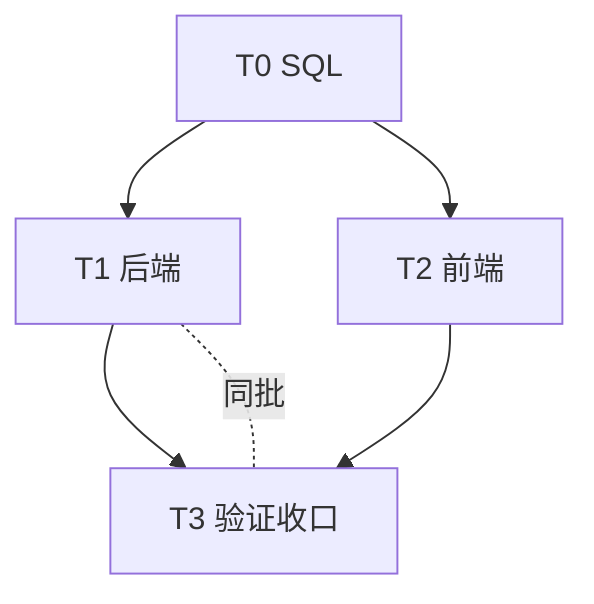

# 04-开发任务清单 · {迭代名称}

<!-- 填写纪律（SSOT：engine/doc-style-guide.md）
     ① 表格只放 4 列（编号/类型/文件/状态）；细节写"条目块"，验证证据进 §3 或附录
     ② 阶段划分与层名按项目实际裁剪（分层映射见 project/project.manifest.yaml）
     ③ 结构增强：>200 行加 `## 目录`；引用写相对链接；支线依据下沉脚注；依赖图用 Mermaid（SSOT §7）
     ④ 生成后自检：python scripts/doc_lint.py <本文件> -->

| 项 | 值 |
|:--|:--|
| 迭代 ID | `YYYY-MM-DD-NNN-{名称}` |
| 阶段 | 04-开发实现 |
| 状态 | ⏳ 进行中 |
| 来源 | [03-技术方案](../03-技术方案/03-技术方案.md) |
| 复杂度 | 🔴 复杂（实际 N 分） |
| 更新时间 | YYYY-MM-DD |

---

## 结论摘要

- **进度**：N / M 完成（⬜ X 待开始）
- **关键路径**：T0 → T1 → T3
- **阻塞**：无 / …
- **下一步**：

---

## 1. 任务拆解

> 表格 4 列；下方条目块按需添加（示例见 §1.1 的 T0-1）。

### 1.1 阶段一：数据库脚本（T0）

| 编号 | 类型 | 文件 | 状态 |
|:--:|:--:|:--|:--:|
| T0-1 | ADDED | `sql/xx.sql` | ⬜ |

#### T0-1 · {一句话做什么}

- 改动：{关键语句 / 签名，≤3 行}
- 验证：{判据 + 结果}

### 1.2 阶段二：后端（T1）

| 编号 | 类型 | 文件 | 状态 |
|:--:|:--:|:--|:--:|

### 1.3 阶段三：前端（T2）

| 编号 | 类型 | 文件 | 状态 |
|:--:|:--:|:--|:--:|

### 1.4 阶段四：验证与收口（T3）

| 编号 | 类型 | 事项 | 状态 |
|:--:|:--:|:--|:--:|

## 2. 依赖关系

> 同批 / 强约束用虚线 `-.-` 或 `-.->` 标注；关键路径在「结论摘要」中声明
> （并行决策见 engine/team-agent-strategy.md）。单图节点 ≤ 25 个，超出拆多图。

## 3. 验证结果

<!-- 按验收判据逐条：AC-1 … ✅ 证据一句话。无 AC 的迭代按"构建/端点/界面"三类列。 -->

- AC-1 {判据}：⬜ / ✅ {证据}
- AC-2 {判据}：⬜ / ✅ {证据}

## 待办与风险

| # | 事项 | 落点 | 状态 |
|:--:|:--|:--|:--:|

---

## 附录 A · 交叉审查处置

## 附录 B · 实施记录

| 编号 | 文件 | 完成时间 | 备注 |
|:--:|:--|:--|:--|
